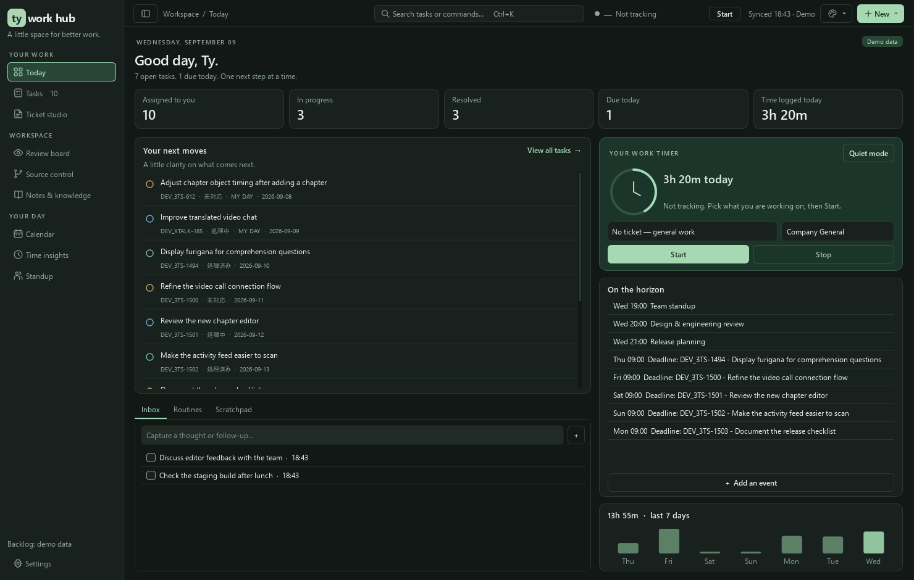
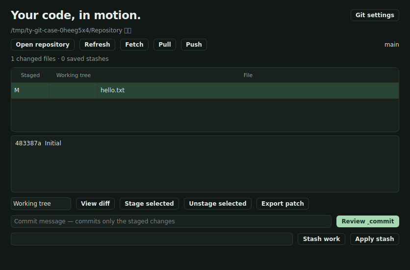

# Ty Work Hub

A native Windows and Linux desktop workspace for focused software work: Git and SVN projects, Backlog tasks, planning, notes, standup, and local AI.

The September 2026 rewrite introduces a virtual task browser, a calmer Today workspace, and six built-in themes. The existing Backlog, Obsidian, local AI, and SVN integrations remain available.



## Windows installation

From this directory:

```powershell
.\.venv\Scripts\python.exe main.py
```

For a fresh installation:

```powershell
python -m venv .venv
.\.venv\Scripts\python.exe -m pip install -r requirements.txt
.\.venv\Scripts\python.exe main.py
```

Use Python 3.12. For a windowless launch, run `TyWorkHub.pyw` with the environment's `pythonw.exe`.

To explore the redesign with sample tickets, schedule, routines, and work history:

```powershell
.\.venv\Scripts\python.exe main.py --demo
```

Demo mode uses a temporary data directory, bypasses Backlog credentials, and discards its local changes when closed. Normal launch uses your existing settings and local data.

## Linux installation

Use Python 3.12 or newer and a graphical desktop. Clone the private repository while signed into your GitHub account:

```bash
git clone https://github.com/TylerFreemont0712/ty-work-hub.git
cd ty-work-hub
bash tools/setup-linux.sh --system-deps
bash run.sh
```

The setup script supports Ubuntu/Debian and Fedora. `--system-deps` explicitly installs Python/Git, Qt runtime libraries, fonts, a desktop keyring, and polkit using `sudo`. If those are already installed, use `bash tools/setup-linux.sh` to create only the local Python environment. Use `bash run.sh --demo` for a temporary sample workspace. Create the virtual environment separately on each computer.

On other distributions, install Python 3.12+, Git, the [Qt Linux runtime libraries](https://doc.qt.io/qt-6/linux-requirements.html), and a Secret Service keyring, then run the setup script without `--system-deps`. Japanese text benefits from Noto CJK fonts. Saved credentials require an unlocked desktop keyring; `BACKLOG_API_KEY` can be used as an environment override. Preferences live in `~/.ty-work-app` on both platforms.

Git and the SVN command-line workflows work on Linux. TortoiseSVN is Windows-only; use the built-in status, diff, patch, and comparison tools on Linux. External applications such as Obsidian and Codex must be installed separately. Linux support is tested on Ubuntu WSL; desktop keyring authorization and package-install prompts depend on your distribution.

## Git workspace

Open **Settings → Git** to select Git or SVN as the default, detect a Git executable, and choose a local repository root. New installations default to Git; an existing configuration with SVN profiles keeps SVN as its default. Both tabs stay available under **Source control**.

The Git workspace works without a Backlog ticket:

- Open an existing local clone and inspect the branch, recent commits, staged changes, and working-tree changes.
- Select files to view a diff, stage, or unstage them. New and deleted files are supported.
- Enter a message, review the staged patch, and explicitly commit. Unstaged changes remain untouched. A changed staging area invalidates the preview.
- Fetch, pull with fast-forward only, or push using the repository's configured remote/upstream. Pull and push require confirmation. Configure credentials or SSH in Git itself; network commands fail with guidance rather than waiting on a terminal password prompt.
- Stash tracked and untracked changes after confirmation, then apply a saved stash without deleting it. Conflicts remain for manual resolution.
- Export a binary-capable patch of tracked changes. Stage new files first to include them. With no commits, exports contain staged changes only. Git exports are separate from the ticket-aware SVN patch shelf.

**Install Git** shows the exact command before invoking winget on Windows, or apt, dnf, zypper, or pacman through polkit on Linux. If a required installer component is unavailable, Settings shows a terminal command or official instructions. Existing installations are detected and reused. This installs Git, not SVN or TortoiseSVN.



## Workspaces

| Workspace | What you can do |
| --- | --- |
| **Today** | See priorities, upcoming events, daily totals, and a seven-day work chart. Single-click a priority to select it for focus; double-click opens its task inspector. Capture thoughts, maintain daily/weekly routines, and autosave a scratchpad. |
| **Tasks** | Search ticket keys, descriptions, people, and projects. Switch task views, save filters, sort naturally, select multiple tasks, star items, plan My Day, acknowledge revisions, and open notes. Enter or double-click opens Ticket studio. |
| **Ticket studio** | Read ticket context, comments, activity, and notes. Generate local AI briefs, structured note drafts, study material, and Japanese comment drafts grounded in saved patches. Review drafts before applying them. |
| **Review board** | Track tickets assigned to others. Acknowledge or hide the current revision, open the ticket, or stop tracking. Changed tickets resurface. |
| **Source control** | Git status/diff, stage/unstage, reviewed commits, remote sync, retained stashes, and patch exports. The SVN tab keeps verified ticket patches, shelve/restore, locks, comparisons, and optional Windows TortoiseSVN actions. |
| **Notes & knowledge** | Connect an Obsidian vault, browse and edit Markdown, follow wiki links, inspect metadata, and use ticket-aware AI actions. |
| **Calendar** | Plan in month, week, day, or agenda view. Create/edit events, see deadlines and work sessions, and inspect overlapping events. Hours outside your schedule, including the lunch break, are shaded. |
| **Time insights** | See where your hours went: counted time per day, a timeline of the selected day, and breakdowns by ticket and by project, with every session listed. |
| **Standup** | Prepare talking points, yesterday/today/blockers, and meeting notes. Track the speaking order, browse daily history, populate from My Day and logged work, copy a summary, or export to Obsidian. Existing text is preserved when importing tasks. |

The work timer lives in the top row of every workspace, so a running session is never out of sight. The right-side task inspector brings together work timers, remote Backlog actions, and local planning. At narrow widths, secondary task columns collapse and the inspector scrolls. All actions remain available through context menus or the command palette.

The palette button in the top bar opens the theme picker; Ctrl+Shift+T steps to the next theme. Settings controls the theme, density, font size, and opening workspace.

## Themes

| Theme | Appearance |
| --- | --- |
| **Sage Dark** | Charcoal and sage. The original workspace, and the default. |
| **Midnight** | Deep navy with a clear blue accent. |
| **Ember** | Warm low light with an amber accent. |
| **Graphite** | Neutral high contrast with no colour cast. |
| **Sage Light** | Paper white with a sage accent. |
| **Nordic Light** | Cool daylight with a solid blue accent. |

Every theme is one palette in [ui/theme.py](ui/theme.py) covering surfaces, text, semantic status colours, and painted charts. Adding a theme means adding one entry there; the stylesheet, icons, task pills, calendar blocks, and diff colours all follow it.

## Many patches on one ticket

A ticket that spans several days usually produces several patches. Each one is saved with:

- a **label** — a short name for that change, not the ticket title,
- a **position** — `#1`, `#2`, `#3` within the ticket, assigned automatically,
- an optional **group** — Backend, Review fixes, or any name you use, and
- an optional **note** — what is in the patch, or what still has to happen to it.

Create patch and Shelve changes both ask for these before writing anything; the next position is shown next to the Ticket field. In the Patch Shelf you can filter by label, group, ticket, or file name, sort by any column, and right-click a patch to edit its details, change only its group, apply it, or delete it. **Renumber this ticket's patches** gives an older series positions in creation order. Editing only rewrites the manifest — patch files keep the names they were created with.

## The work timer

One timer runs at a time and it is always visible in the top row: a dot, the counted time, what it is
tracking, and a Start/Stop button. **Ctrl+Shift+S** toggles it from anywhere.

Start it from Today with two dropdowns:

- **Ticket** — any open ticket, or *No ticket — general work*.
- **Project** — follows the ticket you pick, and can be overridden. Work with no Backlog project of its
  own is filed under **Company General**, which you can rename in Settings → Schedule.

The Today card's Start button only starts the clock. Starting from the ticket inspector still offers to
move the ticket to its in-progress status and create its note, as before.

### Only your working hours count

The timer records exactly when you started and stopped, and totals count only the part that falls inside
your schedule. Evenings, weekends, and breaks are deducted instead of having to be remembered — leave the
timer running overnight and the next morning's total is still right. While a session is outside your
hours the top-bar chip says *paused* and tells you when counting resumes.

Settings → Schedule controls the working day, which days of the week count, any number of breaks, and the
general project name. It ships as **Mon–Fri 09:00–18:00 with lunch 12:00–13:00**. Turning off *Only count
time inside the schedule* counts every tracked minute instead.

## Connect your tools

- **Backlog:** Settings → Backlog. The API key uses your system keyring; `BACKLOG_API_KEY` is an optional environment override. Check the space URL and assignee for your own account before connecting. The app uses demo tickets when no key is configured. Refreshes run in background threads, and the last successful results remain available offline.
- **Obsidian:** Settings → Obsidian. Choose a vault and ticket/daily/programming folders. Generated note updates keep the existing managed-section and backup behavior. **Update note only** in Notes & knowledge regenerates just that ticket's note with the local AI: you see the exact text first, the previous version is backed up, and no study material or Backlog comment is touched. **Draft note & lessons** is the older full flow that reviews in Ticket studio.
- **Local AI:** Settings → Local AI. Configure an OpenAI-compatible llama.cpp endpoint, then use Test connection or Load models. Both connection checks now run in the background.
- **Git:** Settings → Git. Choose a repository, detect/install Git, and set the default source-control provider.
- **SVN:** Settings → Source Control. Configure `svn` (`svn.exe` on Windows), optional Windows TortoiseSVN, allowed working-copy profiles, and the patch shelf. Existing previews, scoped confirmations, patch integrity checks, and cancellation remain in place.
- **Project environments and launchers:** Available in Settings and the ticket inspector. The top-bar **New** menu includes custom launchers, Open Codex, and Open Backlog.

See [the integration reference](docs/integration-reference.md) for the detailed SVN, AI, environment, and note workflows inherited from the previous version. Its original UI labels may differ.

## Keyboard workflow

| Shortcut | Action |
| --- | --- |
| Ctrl+K | Search commands, workspaces, and loaded tickets |
| Ctrl+F | Search tasks |
| Ctrl+1 … Ctrl+9 | Navigate workspaces in sidebar order |
| Ctrl+B | Collapse/expand sidebar |
| Ctrl+Shift+T | Switch to the next theme |
| Ctrl+Shift+S | Start or stop the work timer |
| Ctrl+Shift+B | Toggle task inspector |
| Ctrl+R | Refresh Backlog |
| Ctrl+N | New calendar event |
| Ctrl+S | Start work on the selected ticket |
| Ctrl+Shift+N | Open the selected ticket's note |
| Ctrl+Shift+R | Open Ticket studio |
| Ctrl+Shift+M | Add/remove My Day |
| Ctrl+Alt+S | Open Source control |
| Ctrl+, | Settings |
| Escape | Exit quiet/focus mode |
| J / K, Space, Enter | In the task table: move, star, open Ticket studio |

## Data and reliability

Normal app data stays in `~/.ty-work-app`. Set `TY_WORK_APP_HOME` before launch to use another directory. Existing JSON file formats are preserved.

- Calendar writes are atomic and restore in-memory state after a failed save.
- Workspace writes skip unchanged content and roll back failed writes.
- Scratchpad and standup edits use debounced autosave and flush on exit. A failed save keeps the window open with recovery feedback.
- One active timer is indexed for constant-time lookup, and work totals correctly split sessions across midnight and across the schedule's own windows.
- Background operations are allowed to finish or cancel before application shutdown.
- Remote bulk status updates appear as successful only after Backlog confirms them.

## Verification

```powershell
$env:QT_QPA_PLATFORM = "offscreen"
$env:TY_WORK_APP_HOME = Join-Path $env:TEMP ("ty-work-check-" + [guid]::NewGuid())
.\.venv\Scripts\python.exe -m tests.ui_smoke
.\.venv\Scripts\python.exe -m tests.svn_smoke
.\.venv\Scripts\python.exe -m tests.svn_integration
.\.venv\Scripts\python.exe -m tests.rewrite_smoke
.\.venv\Scripts\python.exe -m tests.git_integration
```

The rewrite suite covers sorting/selection, 10,000 tickets, overnight calendar blocks, failed writes, scratchpad/routines, standup history, background AI connection checks, bounded command-search results, that every theme defines a complete valid palette, and that evenings, weekends, and breaks are deducted from work totals.

The local benchmark recorded approximately **23 ms to populate 10,000 ticket rows** and **9 ms to filter them**. These measure model population/filtering, not network sync or total application startup; machine and dataset affect timings. The task table creates **zero widgets per row**. Running the rewrite suite writes a local `artifacts/performance.json` report.

On Linux, use `.venv/bin/python` with `QT_QPA_PLATFORM=offscreen`, an isolated `TY_WORK_APP_HOME`, and `PYTHON_KEYRING_BACKEND=keyring.backends.null.Keyring`. The Git suite uses temporary repositories and a local bare remote. The GitHub Actions workflow runs desktop and Git checks on Windows and Ubuntu, plus real SVN integration on Ubuntu.

Render isolated demo screenshots with:

```powershell
.\.venv\Scripts\python.exe tools\preview.py
```

Screenshots are in [artifacts](artifacts). Live Backlog and llama.cpp calls are separate from the deterministic regression suites.

See [architecture notes](docs/architecture.md) for the rewrite's boundaries and performance decisions.
